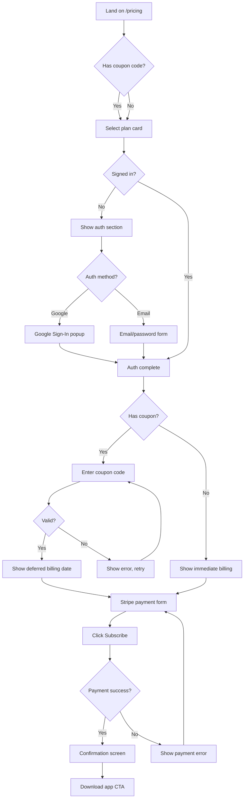
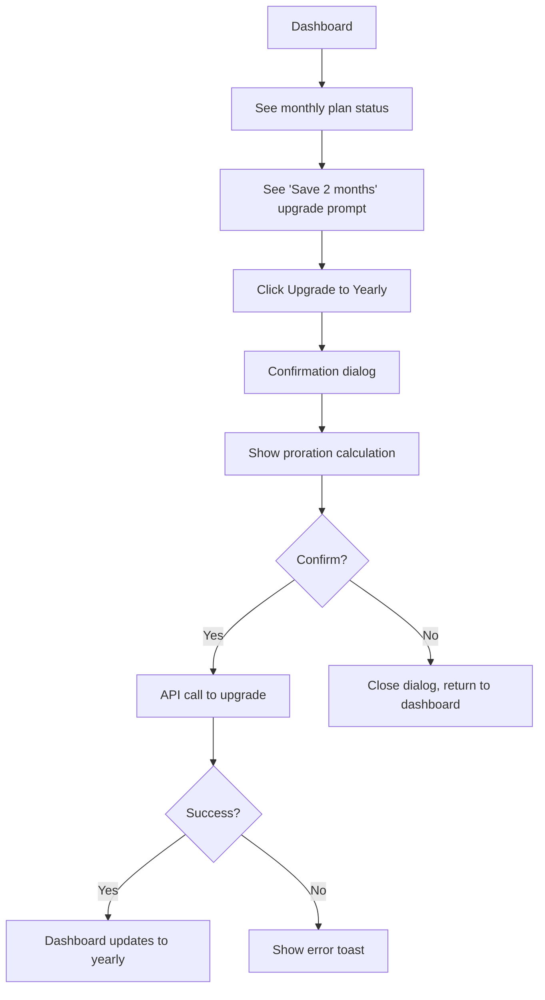
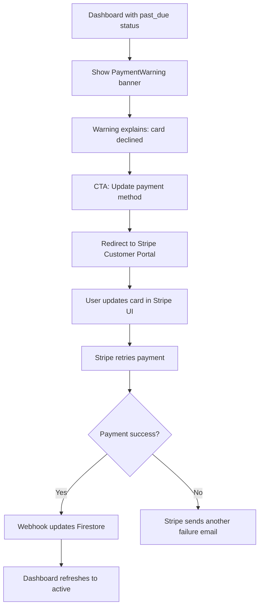
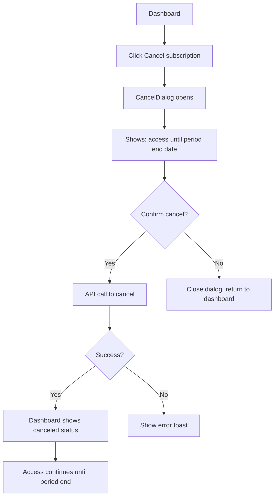

# UX Design Specification WardenWeb

**Author:** Developer
**Date:** 2026-02-06

---

## Executive Summary

### Project Vision

WardenWeb is the subscription management portal for the Warden mobile app — a specialized video review tool for EVA After-h coaches. The portal follows a "Reader App" model, enabling coaches to subscribe via Stripe on the web (bypassing 30% app store fees) while serving as a professional web presence for Discord-based marketing and word-of-mouth discovery.

From a UX perspective, WardenWeb is not a product coaches will use daily. It is a **transactional utility** — coaches arrive with a specific intent (subscribe, manage billing, upgrade, cancel), accomplish their goal, and leave. The UX must therefore prioritize **clarity, speed, and trust** over engagement or exploration. Every screen should feel purposeful, with zero unnecessary friction between intent and action.

### Target Users

**Primary: The Coach — Thomas, 26**
Thomas is an EVA After-h coach who discovers Warden through Discord word-of-mouth. He typically visits WardenWeb from his phone or laptop after work, often tired. He is moderately tech-savvy (comfortable with Google accounts and online payments) but has zero patience for complex flows. He wants to subscribe quickly and get back to the mobile app.

**Secondary: The Active Player — Lucas, 22**
Lucas receives coaching clips from Thomas via Discord and decides to subscribe independently. He is younger, mobile-first, and expects modern, fast checkout experiences similar to what he sees in gaming and SaaS products.

**Shared Characteristics:**
- French-speaking (EVA community is primarily French)
- Familiar with Discord, Google accounts, and online payments
- Mobile-first but may use desktop
- Low tolerance for friction — will abandon checkout if confused
- Trust is built through professional presentation, not flashy design

### Key Design Challenges

- **Single-use friction sensitivity**: Users visit WardenWeb infrequently. Every visit must feel immediately clear — no learning curve, no "where was that button?" moments.
- **Trust for payment**: Users are entering payment information on a site they may have never seen before, discovered through a Discord link. The design must communicate professionalism and security instantly.
- **Bilingual context**: The EVA community speaks French, but the technical infrastructure (Stripe, Firebase) uses English. The UI must handle this gracefully — French marketing copy with clear technical terms.
- **Coupon-first acquisition**: Many users arrive with a coupon code. The flow must make coupon redemption obvious and reassuring ("You won't be charged until [date]").

### Design Opportunities

- **One-page checkout**: Combining plan selection, authentication, and payment on a single page eliminates navigation confusion and reduces drop-off.
- **Dashboard simplicity**: With only ~5 actions available (view status, upgrade, cancel, update payment, view history), the dashboard can be exceptionally clean and scannable.
- **Trust through transparency**: Showing exact dates, amounts, and proration calculations builds confidence that this is a professional service.

---

## Core User Experience

### Defining Experience

The defining experience of WardenWeb is: **"See price, pay, done."**

Every successful product has a core interaction that, if nailed, makes everything else follow. For WardenWeb, that interaction is the checkout flow — specifically the moment when a coach with a coupon code goes from "I just got this link on Discord" to "I'm subscribed and ready to download the app" in under 60 seconds.

This is not an app users explore or return to frequently. The magic moment is the frictionless transition from discovery to paid subscriber.

### Platform Strategy

- **Primary platform**: Mobile web (320px-768px) — coaches receive Discord links on their phones
- **Secondary platform**: Desktop (1024px+) — some coaches discover WardenWeb on their computer
- **Input mode**: Touch-first, with full keyboard/mouse support on desktop
- **Offline**: Not required — WardenWeb is always online (payment processing requires connectivity)
- **Performance**: Pages must load in < 2.5s (LCP target from PRD) — users arriving from Discord links expect instant loading

### Effortless Interactions

- **Plan selection** should require a single tap — no comparison tables, no feature matrices. Two cards: monthly and yearly, with the savings clearly shown.
- **Authentication** should default to Google Sign-In (one tap) with email/password as fallback. No username required, no profile setup.
- **Coupon entry** should be a single input field that validates in real-time and immediately shows the deferred billing date.
- **Dashboard actions** should be visible without scrolling — subscription status, next payment date, and primary actions all above the fold.

### Critical Success Moments

1. **First impression** (landing page): The coach must immediately understand "this is the subscription portal for Warden" and see a clear path to pricing.
2. **Coupon validation**: When a coupon code is entered, the user must see instant confirmation ("2 months free — first charge on [date]") — this is the trust-building moment.
3. **Post-checkout confirmation**: After payment, the user must know exactly what to do next ("Download Warden on your phone" with direct app store links).
4. **Payment failure recovery**: When a card fails, the warning must be clear and the fix path obvious (one click to Stripe Customer Portal).

### Experience Principles

1. **Intent-driven**: Every page has one primary purpose. No distractions, no cross-selling, no "explore more" prompts.
2. **Transparent pricing**: All amounts, dates, and calculations are visible. No hidden fees, no surprises at checkout.
3. **Minimal authentication**: Get users signed in with the least friction possible (Google one-tap preferred).
4. **Professional trust**: Clean, modern design that communicates "legitimate SaaS product" — not flashy, not minimal to the point of suspicion.

---

## Desired Emotional Response

### Primary Emotional Goals

- **Confidence**: "This is a professional, trustworthy service. My payment information is safe here."
- **Efficiency**: "That was fast. I'm subscribed and ready to go."
- **Clarity**: "I understand exactly what I'm paying, when I'm paying, and what I get."

### Emotional Journey Mapping

| Stage | Desired Emotion | Design Approach |
|-------|----------------|-----------------|
| **Discovery** (landing page) | Curiosity → Recognition | Show the Warden value proposition they already heard about on Discord |
| **Pricing** | Confidence → Decision | Clear pricing, no ambiguity, visible coupon field |
| **Authentication** | Ease → Progress | Google one-tap feels instant; email/password is straightforward |
| **Payment** | Trust → Commitment | Stripe Elements look professional; deferred billing reassures |
| **Confirmation** | Satisfaction → Excitement | Clear next steps, app download links, "Welcome!" feeling |
| **Dashboard** (return visit) | Control → Ease | Everything visible at a glance, actions are obvious |
| **Payment failure** | Concern → Relief | Clear warning, one-click fix path, no panic-inducing language |
| **Cancellation** | Respect → Acceptance | No guilt trips, clear "access until [date]" message |

### Micro-Emotions

- **Confidence over confusion**: Every label, button, and status indicator must be unambiguous. If a user hesitates, the design has failed.
- **Trust over skepticism**: Stripe branding visible during payment, HTTPS indicators, professional visual design.
- **Accomplishment over frustration**: Checkout completion should feel like a small win — a confirmation screen with a clear "you're all set" message.

### Emotional Design Principles

1. **Never surprise negatively**: All charges, dates, and terms visible before commitment.
2. **Respect the exit**: Cancellation flow is clean, honest, and non-manipulative. Access continues until period end.
3. **Celebrate completion**: Post-checkout and post-upgrade moments get brief, warm confirmation.
4. **De-escalate failures**: Payment failures use calm, helpful language — not red alerts or exclamation marks.

---

## UX Pattern Analysis & Inspiration

### Inspiring Products Analysis

**Stripe Checkout (Stripe's own hosted checkout)**
- Minimal, focused payment form with no distractions
- Real-time validation and clear error messages
- Trust signals (lock icon, "Powered by Stripe" badge)
- Single-column layout that guides the eye top-to-bottom
- **Lesson for WardenWeb**: Adopt the single-column, focused checkout pattern. Use Stripe Elements for native trust signals.

**Notion Pricing Page**
- Two clear pricing tiers with toggle between monthly/yearly
- Savings percentage highlighted on yearly plan
- Feature comparison below the fold — pricing above
- Clean typography with generous whitespace
- **Lesson for WardenWeb**: Keep plan comparison simple. Two cards side by side (or stacked on mobile), yearly savings prominently displayed.

**Linear.app (Account Settings)**
- Dashboard is a clean single page with clear sections
- Actions (upgrade, cancel) are accessible but not aggressive
- Status information is scannable at a glance
- Monochrome palette with color reserved for status indicators
- **Lesson for WardenWeb**: Dashboard layout — clear sections for status, actions, and history. Color coding for subscription status only.

### Transferable UX Patterns

**Navigation Patterns:**
- Minimal top navigation (logo + sign-in/dashboard link only)
- No sidebar navigation — pages are few enough for direct links
- Breadcrumb-free — each page is a standalone destination

**Interaction Patterns:**
- Single-page checkout (plan selection → auth → payment on one page)
- Inline form validation with real-time feedback
- Confirmation dialogs for destructive actions (cancel subscription)
- Redirect to Stripe Customer Portal for card management (no custom UI)

**Visual Patterns:**
- Card-based plan display with clear visual hierarchy (yearly plan slightly emphasized)
- Status badges for subscription state (active = green, past_due = amber, canceled = gray)
- Skeleton loading states for dashboard data

### Anti-Patterns to Avoid

- **Feature comparison tables**: WardenWeb has one product at two price points. A feature table adds confusion, not clarity.
- **Aggressive upsell modals**: No popups pushing yearly upgrades. A subtle "Save 2 months" message is sufficient.
- **Dark patterns in cancellation**: No multi-step cancellation, no guilt-trip copy, no hidden "cancel" buttons.
- **Complex onboarding flows**: No welcome wizards, tutorial modals, or "set up your profile" screens. Subscribe and go.
- **Custom payment forms**: Always use Stripe Elements — never build custom card inputs.

### Design Inspiration Strategy

**Adopt:**
- Stripe Checkout's focused, single-column payment flow
- Linear's clean dashboard layout with status-first information hierarchy
- Notion's clear pricing card design with monthly/yearly toggle

**Adapt:**
- Notion's pricing toggle → simplified for only 2 plans (no enterprise tier)
- Linear's settings → stripped to essentials (no team management, no integrations)

**Avoid:**
- SaaS landing pages with endless scrolling feature lists
- Complex pricing calculators or custom plan builders
- Multi-page checkout wizards with progress bars

---

## Design System Foundation

### Design System Choice

**Selected: shadcn/ui + Tailwind CSS v4**

shadcn/ui provides accessible, well-designed React components built on Radix UI primitives and styled with Tailwind CSS. Components are copied into the project (not an npm dependency), giving full ownership and customization control.

### Rationale for Selection

- **Architecture alignment**: The architecture document already specifies shadcn/ui + Tailwind CSS v4 as the component library
- **Accessibility built-in**: Radix UI primitives provide WCAG 2.1 Level A compliance out of the box (keyboard navigation, ARIA attributes, focus management)
- **Tailwind v4 integration**: shadcn/ui is designed specifically for Tailwind, ensuring consistent styling
- **Copy-paste ownership**: No version lock-in, full control over component behavior and appearance
- **AI-agent friendly**: Standard patterns that AI agents can follow consistently
- **Minimal bundle size**: Only include components actually used — no tree-shaking needed

### Implementation Approach

1. Initialize shadcn/ui via `components.json` configuration
2. Install only required components: Button, Card, Dialog, Form, Input, Badge, Alert, Skeleton
3. Customize theme tokens (colors, border radius, spacing) via Tailwind config
4. Build feature-specific components (PlanSelector, SubscriptionCard, etc.) using shadcn/ui primitives

### Customization Strategy

- **Theme tokens**: Override shadcn/ui defaults with WardenWeb brand colors via CSS custom properties
- **Component variants**: Use shadcn/ui's built-in variant system (e.g., Button: default, destructive, outline, ghost)
- **No custom CSS classes**: All styling via Tailwind utilities (per architecture conventions)
- **Dark mode**: Not in MVP scope — single light theme

---

## 2. Core User Experience

### 2.1 Defining Experience

**"Subscribe in 60 seconds from a Discord link."**

The core interaction that defines WardenWeb is the journey from clicking a shared link on Discord to becoming a paying subscriber. This single flow encompasses the landing page impression, plan selection, authentication, coupon entry, and payment — all designed to complete in under 60 seconds.

If this flow is effortless, everything else (dashboard, upgrades, cancellation) follows naturally because trust and familiarity have been established.

### 2.2 User Mental Model

Users arrive at WardenWeb with a specific mental model:
- "I got a link from someone on Discord"
- "I need to subscribe to use the Warden app"
- "There might be a coupon code that gives me free months"
- "This should work like any other online subscription (Spotify, Netflix, etc.)"

**What users expect:**
- See pricing immediately (not hidden behind sign-up)
- Sign in with Google (one tap, no new password to remember)
- Enter coupon code and see immediate confirmation
- Enter card, confirm, and be done

**Where users might get confused:**
- If pricing is not visible without signing in first
- If the coupon field is hidden or hard to find
- If the relationship between WardenWeb (portal) and Warden (app) is unclear
- If they don't understand proration when upgrading

### 2.3 Success Criteria

| Criteria | Measurement |
|----------|-------------|
| Checkout completion | Coach subscribes without any support intervention |
| Time to subscribe | < 60 seconds from pricing page to confirmation |
| Coupon redemption | User understands deferred billing date immediately |
| Dashboard comprehension | User finds their subscription status in < 3 seconds |
| Upgrade completion | User understands proration and confirms upgrade |
| Cancel completion | User cancels without confusion about remaining access |

### 2.4 Novel UX Patterns

WardenWeb uses entirely **established UX patterns** — no novel interactions required. The innovation is in the simplicity and focus:

- Standard card-based pricing display
- Standard Google OAuth / email-password authentication
- Standard Stripe Elements payment form
- Standard dashboard with status + actions

The only semi-novel pattern is the **single-page checkout** that combines plan selection, auth, and payment. This is increasingly common in SaaS but requires careful progressive disclosure — showing the auth step only after plan selection, and payment only after authentication.

### 2.5 Experience Mechanics

**Checkout Flow Mechanics:**

**1. Initiation:**
- User clicks CTA on landing page ("See pricing") or arrives directly on `/pricing`
- Two plan cards displayed immediately — monthly (7.99/mo) and yearly (79.90/yr)

**2. Plan Selection:**
- User taps a plan card → card becomes selected (visual highlight)
- Auth section reveals below (progressive disclosure)

**3. Authentication:**
- Google Sign-In button (primary, prominent)
- "Or sign in with email" link (secondary, below)
- If already signed in, this step auto-skips

**4. Coupon Entry (Optional):**
- "Have a coupon code?" expandable section
- Input field with real-time validation
- Success: Shows deferred billing date and discount amount
- Error: Shows "Invalid or expired code" inline

**5. Payment:**
- Stripe Elements card input (card number, expiry, CVC)
- Order summary sidebar/section showing plan, price, coupon discount, total
- "Subscribe" button with price confirmation

**6. Completion:**
- Confirmation screen: "You're subscribed!"
- Clear next step: "Download Warden" with app store links
- Link to dashboard for account management

---

## Visual Design Foundation

### Color System

**Primary Palette** (Derived from professional SaaS conventions, aligned with trust/efficiency emotional goals):

| Token | Usage | Value |
|-------|-------|-------|
| `primary` | CTAs, links, active states | Deep blue (#2563EB) — professional, trustworthy |
| `primary-foreground` | Text on primary backgrounds | White (#FFFFFF) |
| `secondary` | Secondary buttons, subtle highlights | Slate (#64748B) |
| `secondary-foreground` | Text on secondary backgrounds | White (#FFFFFF) |
| `accent` | Yearly plan highlight, savings badge | Indigo (#4F46E5) |
| `background` | Page backgrounds | White (#FFFFFF) |
| `foreground` | Primary text | Slate 900 (#0F172A) |
| `muted` | Disabled states, placeholder text | Slate 400 (#94A3B8) |
| `muted-foreground` | Secondary text, descriptions | Slate 500 (#64748B) |
| `card` | Card backgrounds | White (#FFFFFF) |
| `border` | Card borders, dividers | Slate 200 (#E2E8F0) |

**Semantic Status Colors:**

| Token | Usage | Value |
|-------|-------|-------|
| `success` | Active subscription, payment confirmed | Green (#16A34A) |
| `warning` | Past-due status, payment failure alert | Amber (#D97706) |
| `destructive` | Cancel button, error states | Red (#DC2626) |
| `info` | Informational banners, coupon details | Blue (#2563EB) |

**Accessibility:** All color combinations meet WCAG 2.1 Level A contrast requirements (minimum 4.5:1 for normal text, 3:1 for large text).

### Typography System

**Font Stack:**
- **Primary**: `Inter` (Google Fonts) — clean, modern, excellent readability at all sizes
- **Fallback**: `system-ui, -apple-system, sans-serif`
- **Monospace** (for amounts/dates): `JetBrains Mono` or system monospace

**Type Scale** (based on Tailwind defaults):

| Level | Size | Weight | Usage |
|-------|------|--------|-------|
| `h1` | 2.25rem (36px) | Bold (700) | Page titles (Landing headline) |
| `h2` | 1.5rem (24px) | Semibold (600) | Section headings (Dashboard sections) |
| `h3` | 1.25rem (20px) | Semibold (600) | Card titles (Plan names) |
| `body` | 1rem (16px) | Regular (400) | Body text, descriptions |
| `body-sm` | 0.875rem (14px) | Regular (400) | Secondary text, metadata |
| `caption` | 0.75rem (12px) | Medium (500) | Labels, badges, fine print |
| `price` | 2rem (32px) | Bold (700) | Pricing display |
| `price-period` | 1rem (16px) | Regular (400) | "/month" or "/year" suffix |

**Line Heights:**
- Headings: 1.25 (tight)
- Body text: 1.5 (comfortable reading)
- UI elements: 1.0 (compact buttons, badges)

### Spacing & Layout Foundation

**Spacing Scale** (Tailwind 4px base):

| Token | Value | Usage |
|-------|-------|-------|
| `xs` | 4px (1) | Inner padding of badges, icon gaps |
| `sm` | 8px (2) | Input padding, small element gaps |
| `md` | 16px (4) | Card padding, section gaps |
| `lg` | 24px (6) | Section separation |
| `xl` | 32px (8) | Page section spacing |
| `2xl` | 48px (12) | Major section breaks |
| `3xl` | 64px (16) | Page top/bottom padding |

**Layout Principles:**
- **Max content width**: 1200px (centered with auto margins)
- **Card max width**: 480px (for checkout forms and plan cards)
- **Single-column focus**: Checkout and dashboard use single-column layouts for clarity
- **Generous whitespace**: Airy layout communicates professionalism (not density)
- **Consistent gutters**: 16px horizontal padding on mobile, 24px on tablet, 32px on desktop

**Grid System:**
- Landing page: Flexible, content-driven layout
- Pricing page: 2-column grid for plan cards (stacked on mobile)
- Dashboard: Single-column with card-based sections
- Legal pages: Single-column, max-width prose

### Accessibility Considerations

- All interactive elements have visible focus indicators (2px blue outline with 2px offset)
- Touch targets minimum 44x44px on mobile
- Color is never the sole indicator of state — always paired with text or icons
- Form inputs have associated labels (not placeholder-only)
- Error messages are announced to screen readers via `aria-live="polite"`

---

## Design Direction Decision

### Design Directions Explored

Given the project constraints (transactional utility, trust-focused, niche audience), the design direction is guided by established SaaS patterns rather than novel visual explorations. Three directions were considered:

**Direction 1: Minimal Professional**
Clean white backgrounds, blue primary accent, minimal decoration. Emphasis on typography and whitespace. Similar to Stripe's marketing site.

**Direction 2: Dark Confident**
Dark backgrounds with bright accent colors. Gaming-adjacent aesthetic that might resonate with the EVA community. Similar to Linear or Discord's dark mode.

**Direction 3: Warm Approachable**
Subtle warm gray backgrounds, rounded corners, friendly illustrations. Similar to Notion or Cal.com. More personality, less corporate.

### Chosen Direction

**Direction 1: Minimal Professional** — adapted with subtle warmth.

White backgrounds with clean blue primary color, professional typography (Inter), generous whitespace. Subtle warmth added through slightly rounded corners (radius-lg from shadcn/ui), friendly micro-copy, and a hint of indigo accent for the premium yearly plan.

### Design Rationale

- **Trust priority**: Users are entering payment information on an unfamiliar site. Clean, professional design builds trust faster than trendy or playful aesthetics.
- **Content clarity**: White backgrounds with high-contrast text ensure pricing, dates, and status information are instantly readable.
- **Stripe alignment**: Since payment is handled by Stripe Elements, the overall site aesthetic should complement Stripe's clean design language.
- **Low maintenance**: Minimal visual complexity means fewer design decisions during implementation and easier long-term maintenance.
- **Brand neutral**: WardenWeb is a portal for the Warden app, not the main product. The visual identity should be professional without competing with the mobile app's branding.

### Implementation Approach

- shadcn/ui with default "slate" color scheme as base
- Primary color override to blue (#2563EB)
- Border radius: `0.5rem` (rounded-lg) for cards and buttons
- Shadows: Subtle (`shadow-sm`) on cards, none on buttons
- Icons: Lucide (included with shadcn/ui) for consistent iconography

---

## User Journey Flows

### Journey 1: New Coach Subscription (with Coupon)

**Entry**: Coach clicks Discord link → lands on `/pricing` (or `/` → clicks CTA → `/pricing`)



**Key UX decisions:**
- Plan cards visible immediately (no auth gate)
- Auth section appears after plan selection (progressive disclosure)
- Coupon field is always visible (not hidden in "have a code?" accordion) since coupon-first acquisition is the primary model
- Confirmation screen includes direct app store links

### Journey 2: Existing Subscriber — Upgrade to Yearly

**Entry**: Subscriber signs in → `/dashboard`



**Key UX decisions:**
- Upgrade prompt is visible but not aggressive — a subtle card or banner
- Proration calculation shown clearly before confirmation
- Uses shadcn/ui Dialog for confirmation (not a full page redirect)

### Journey 3: Payment Failure Recovery

**Entry**: Subscriber signs in → `/dashboard` shows warning



**Key UX decisions:**
- PaymentWarning is a prominent but calm amber banner (not red panic)
- Single button redirects to Stripe Customer Portal (no custom card update UI)
- Dashboard reflects updated status on next page load (webhook-driven, no real-time)

### Journey 4: Cancellation

**Entry**: Subscriber → `/dashboard` → Cancel



**Key UX decisions:**
- Cancel button is visible but uses outline/ghost variant (not prominent)
- Dialog clearly states "You keep access until [specific date]"
- No guilt-trip copy, no multi-step retention flow
- Status badge changes to gray "Canceled" with end date

### Journey 5: Passive Player → Active Subscriber

**Entry**: Player clicks Warden link from a clip shared on Discord

```mermaid
graph TD
    A[Land on /] --> B[Read value proposition]
    B --> C[Understand Warden is for video review]
    C --> D[Click See pricing CTA]
    D --> E[/pricing page]
    E --> F[Select plan]
    F --> G[Auth + Payment flow]
    G --> H[Confirmation + Download app]
```

**Key UX decisions:**
- Landing page must clearly explain what Warden does (not assume prior knowledge)
- Value proposition speaks to both coaches and individual players
- Same checkout flow as Journey 1 (no special "player" path)

### Journey Patterns

**Common Patterns Across Journeys:**
- **Entry point flexibility**: Users can arrive on any page (landing, pricing, dashboard) and find their way
- **Progressive disclosure**: Information and actions revealed as needed (auth after plan selection, payment after auth)
- **Single-action confirmation**: Destructive or significant actions (cancel, upgrade) use a confirmation dialog
- **Stripe delegation**: Card management and payment processing always handled by Stripe (Elements or Customer Portal)

### Flow Optimization Principles

1. **Minimize steps to value**: Checkout is a single page, not a multi-step wizard
2. **Reduce cognitive load**: Show only relevant information at each decision point
3. **Provide clear feedback**: Every action gets immediate visual confirmation or error
4. **Handle edge cases gracefully**: Expired coupons, failed payments, and network errors have clear recovery paths

---

## Component Strategy

### Design System Components

**From shadcn/ui (used directly or with minor customization):**

| Component | Usage in WardenWeb |
|-----------|--------------------|
| `Button` | CTAs, form submissions, navigation actions |
| `Card` | Plan cards, dashboard sections, subscription info |
| `Dialog` | Cancel confirmation, upgrade confirmation |
| `Form` | Checkout form, auth forms (via React Hook Form) |
| `Input` | Email, password, coupon code fields |
| `Badge` | Subscription status (active, past_due, canceled) |
| `Alert` | Payment failure warning, coupon success/error |
| `Skeleton` | Loading states for dashboard data |

### Custom Components

**Layout Components:**

#### Header
**Purpose:** Top navigation bar across all pages
**Content:** Logo (left), navigation links (center/right), sign-in/dashboard button (right)
**States:** Signed out (shows "Sign In"), signed in (shows "Dashboard" or user avatar)
**Responsive:** Hamburger menu on mobile (< 768px), full nav on desktop

#### Footer
**Purpose:** Site footer with legal links and copyright
**Content:** Links to Privacy Policy, Terms of Service, contact email
**States:** Single state, always visible
**Responsive:** Stacked on mobile, horizontal on desktop

#### CookieBanner
**Purpose:** GDPR cookie consent for Firebase Analytics
**Content:** Brief explanation + Accept/Reject buttons
**States:** Visible (no consent given), hidden (consent stored in localStorage)
**Behavior:** Analytics loaded only after acceptance; banner dismissed on any choice

**Auth Components:**

#### SignInForm
**Purpose:** Email/password authentication
**Content:** Email input, password input, submit button, "Create account" toggle
**States:** Sign-in mode, sign-up mode, loading, error
**Validation:** Zod schema (email format, password min length)

#### GoogleSignInButton
**Purpose:** One-tap Google OAuth sign-in
**Content:** Google icon + "Sign in with Google" text
**States:** Default, loading (spinner), error (toast)
**Behavior:** Opens Firebase `signInWithPopup()`, creates session cookie on success

#### AuthGuard
**Purpose:** Client-side wrapper that redirects unauthenticated users
**Content:** Renders children if authenticated, redirects to `/pricing` if not
**States:** Loading (shows skeleton), authenticated (shows children), unauthenticated (redirects)

**Checkout Components:**

#### PlanSelector
**Purpose:** Display monthly and yearly plan options
**Content:** Two plan cards with price, period, and savings badge (yearly)
**States:** Default (no selection), selected (highlighted border + checkmark)
**Variants:** Horizontal (desktop), stacked (mobile)
**Accessibility:** Radio group semantics, keyboard arrow navigation

#### CouponInput
**Purpose:** Coupon code entry with real-time validation
**Content:** Text input + "Apply" button + validation feedback
**States:** Empty, loading (validating), success (shows discount + deferred date), error (shows message)
**Behavior:** Validates against Firestore `coupon_batches` collection via API

#### CheckoutForm
**Purpose:** Stripe Elements wrapper for card payment
**Content:** Stripe CardElement + order summary + "Subscribe" button
**States:** Default, loading (processing payment), success (redirect to confirmation), error (inline message)
**Behavior:** Creates Stripe subscription via API, handles SCA/3DS if required

**Dashboard Components:**

#### SubscriptionCard
**Purpose:** Display current subscription status at a glance
**Content:** Plan name, status badge, next payment date, price
**States:** Active (green badge), past_due (amber badge + warning), canceled (gray badge + end date)
**Actions:** None (display only — actions are separate components)

#### PaymentHistory
**Purpose:** List of past invoices
**Content:** Table/list of date, amount, status for each invoice
**States:** Loading (skeleton rows), populated (invoice list), empty ("No payments yet")
**Data source:** Stripe API via server-side fetch

#### UpgradeButton
**Purpose:** CTA to upgrade from monthly to yearly
**Content:** "Upgrade to Yearly — Save 2 months" text
**States:** Visible (on monthly plan), hidden (on yearly or canceled plan)
**Behavior:** Opens upgrade confirmation Dialog

#### CancelDialog
**Purpose:** Confirmation dialog for subscription cancellation
**Content:** Warning text, access-until date, confirm/cancel buttons
**States:** Open, loading (processing cancellation), closed
**Behavior:** Calls cancel API, updates dashboard on success

#### PaymentWarning
**Purpose:** Alert banner for past-due payment status
**Content:** Warning icon, explanation text, "Update payment method" button
**States:** Visible (when status is past_due), hidden (otherwise)
**Behavior:** Redirects to Stripe Customer Portal

### Component Implementation Strategy

1. **Start with shadcn/ui base components** — install Button, Card, Dialog, Form, Input, Badge, Alert, Skeleton
2. **Build layout components** — Header, Footer, CookieBanner (used across all pages)
3. **Build auth components** — SignInForm, GoogleSignInButton, AuthGuard (needed before checkout)
4. **Build checkout components** — PlanSelector, CouponInput, CheckoutForm (core revenue flow)
5. **Build dashboard components** — SubscriptionCard, PaymentHistory, UpgradeButton, CancelDialog, PaymentWarning

### Implementation Roadmap

**Phase 1 — Core (Blocks all other work):**
- shadcn/ui base components
- Header, Footer
- SignInForm, GoogleSignInButton, AuthGuard

**Phase 2 — Revenue (Primary business value):**
- PlanSelector, CouponInput, CheckoutForm
- CookieBanner

**Phase 3 — Management (Subscriber retention):**
- SubscriptionCard, PaymentHistory
- UpgradeButton, CancelDialog, PaymentWarning

---

## UX Consistency Patterns

### Button Hierarchy

| Variant | Usage | Example |
|---------|-------|---------|
| **Primary** (filled, blue) | Primary page action, single per view | "Subscribe", "Upgrade to Yearly" |
| **Secondary** (outline) | Secondary actions | "Sign in with email", "View payment history" |
| **Ghost** | Tertiary/navigation actions | "Cancel subscription", "Back" |
| **Destructive** (filled, red) | Irreversible actions | "Confirm cancellation" (inside dialog only) |
| **Link** (text-only, underline) | Inline navigation | "Privacy Policy", "Terms of Service" |

**Rules:**
- Maximum one primary button per visible section
- Destructive actions always require confirmation dialog
- Button text uses action verbs ("Subscribe", "Upgrade", "Cancel") — never vague ("Submit", "OK", "Continue")

### Feedback Patterns

| Type | Component | Duration | Usage |
|------|-----------|----------|-------|
| **Success** | Alert (green) or toast | Persistent or 5s auto-dismiss | Payment confirmed, upgrade complete |
| **Error** | Alert (red) inline | Persistent until resolved | Payment failed, invalid coupon |
| **Warning** | Alert (amber) banner | Persistent until resolved | Past-due payment, expiring subscription |
| **Info** | Alert (blue) inline | Persistent | Deferred billing date, proration details |
| **Loading** | Skeleton or spinner | Until data loads | Dashboard data, payment processing |

**Rules:**
- Inline errors appear directly below the relevant form field
- Page-level alerts appear at the top of the content area
- Toast notifications used only for transient success messages
- Never use alerts for information that requires user action — use inline content instead

### Form Patterns

**Input Fields:**
- All inputs have visible labels above the field (never placeholder-only)
- Required fields have no asterisk (all fields are required in WardenWeb forms)
- Error messages appear below the field in red text with descriptive message
- Real-time validation on blur, not on every keystroke

**Form Layout:**
- Single-column layout for all forms
- Submit button full-width on mobile, right-aligned on desktop
- Loading state on submit button (spinner + disabled)

**Validation Messages:**
- Email: "Please enter a valid email address"
- Password: "Password must be at least 8 characters"
- Coupon: "This coupon code is invalid or expired"
- Payment: Stripe Elements provides its own error messages

### Navigation Patterns

**Header Navigation:**
- Logo (links to `/`) on the left
- Primary nav links in the center (visible on desktop only)
- Auth action on the right: "Sign In" (signed out) or "Dashboard" (signed in)
- Mobile: Logo left, hamburger menu right

**Page Navigation:**
- Landing → Pricing: CTA button ("See pricing")
- Pricing → Dashboard: Auto-redirect after checkout
- Dashboard → Stripe Portal: Button opens in new tab
- All pages → Legal pages: Footer links

**Auth-Based Navigation:**
- Unauthenticated users accessing `/dashboard` → redirect to `/pricing`
- Authenticated users on `/pricing` → skip auth step in checkout
- Post-sign-out → redirect to `/`

### Additional Patterns

**Empty States:**
- Payment history with no payments: "No payments yet. Your first payment will appear here."
- Dashboard before subscription: Redirect to pricing (no empty dashboard state)

**Loading States:**
- Dashboard: Skeleton cards mimicking final layout
- Checkout: Button spinner during payment processing
- Auth: Spinner on Google sign-in button during popup

**Confirmation Dialogs:**
- Title: Clear action description ("Cancel your subscription?")
- Body: Consequences stated plainly ("You'll keep access until [date]")
- Actions: Cancel (ghost button, left) + Confirm (primary or destructive button, right)
- Escape key and backdrop click close the dialog (same as Cancel)

---

## Responsive Design & Accessibility

### Responsive Strategy

**Mobile (320px - 767px) — Primary:**
- Single-column layout throughout
- Plan cards stack vertically
- Full-width buttons and inputs
- Bottom-sticky CTA buttons on checkout
- Hamburger menu for navigation
- Touch targets minimum 44x44px
- Generous vertical spacing between interactive elements

**Tablet (768px - 1023px):**
- Plan cards side-by-side (2-column)
- Navigation links visible (no hamburger)
- Dashboard cards may use 2-column grid
- Same content as desktop, slightly compressed

**Desktop (1024px+):**
- Max content width 1200px, centered
- Plan cards side-by-side with more whitespace
- Dashboard with comfortable spacing
- Sidebar possible but not needed for MVP
- Hover states on interactive elements

### Breakpoint Strategy

Using Tailwind CSS v4 default breakpoints:

| Breakpoint | Value | Design Approach |
|------------|-------|-----------------|
| Default | < 640px | Mobile-first base styles |
| `sm` | 640px | Minor adjustments (wider cards) |
| `md` | 768px | Tablet layout (2-column plans, full nav) |
| `lg` | 1024px | Desktop layout (max-width container) |
| `xl` | 1280px | Wide desktop (more whitespace) |

**Approach:** Mobile-first — base styles target phones, with progressive enhancement via `md:` and `lg:` breakpoint prefixes.

### Accessibility Strategy

**Compliance Level:** WCAG 2.1 Level A (per PRD requirement)

**Color & Contrast:**
- All text meets 4.5:1 contrast ratio against backgrounds
- Status badges use both color AND text labels (e.g., green badge says "Active")
- Focus indicators use 2px blue outline (visible against all backgrounds)
- No information conveyed by color alone

**Keyboard Navigation:**
- All interactive elements reachable via Tab key
- Logical tab order follows visual layout (top-to-bottom, left-to-right)
- Plan selection via arrow keys (radio group pattern)
- Dialog traps focus (Radix UI handles this automatically)
- Escape key closes dialogs and popovers
- Skip link to main content (hidden until focused)

**Screen Reader Support:**
- Semantic HTML: `<header>`, `<nav>`, `<main>`, `<footer>`, `<section>`
- Form inputs with `<label>` elements (not `aria-label` alone)
- Status changes announced via `aria-live="polite"` regions
- Subscription status badge has `aria-label` with full text (e.g., "Subscription status: active")
- Loading states announced: "Loading dashboard data"
- Error messages associated with inputs via `aria-describedby`

**Touch & Motor:**
- Minimum touch target: 44x44px
- Adequate spacing between interactive elements (minimum 8px gap)
- No time-limited interactions (no auto-closing toasts that require action)
- No drag-and-drop or gesture-only interactions

### Testing Strategy

**Automated Testing:**
- axe-core integration in Vitest component tests
- Lighthouse accessibility audit in CI pipeline
- ESLint plugin `eslint-plugin-jsx-a11y` for static analysis

**Manual Testing:**
- Keyboard-only navigation through all flows
- VoiceOver (macOS/iOS) screen reader testing
- Color blindness simulation (Chrome DevTools)
- Mobile device testing on actual phones

### Implementation Guidelines

**HTML Structure:**
```
<body>
  <a href="#main" class="sr-only focus:not-sr-only">Skip to content</a>
  <Header />         <!-- <header> with <nav> -->
  <main id="main">   <!-- Primary content -->
    <PageContent />
  </main>
  <Footer />          <!-- <footer> -->
  <CookieBanner />    <!-- Fixed position, bottom -->
</body>
```

**Component Requirements:**
- Every `` has descriptive `alt` text
- Every `<button>` has visible text or `aria-label`
- Every form has a `<form>` element with `aria-label` or associated heading
- Modals use `role="dialog"` with `aria-labelledby` (Radix provides this)
- Loading skeletons have `aria-busy="true"` and `aria-label="Loading"`

---

## Page-by-Page Wireframe Specifications

### Landing Page (`/`)

```
┌─────────────────────────────────┐
│ [Logo]              [Sign In]   │  ← Header
├─────────────────────────────────┤
│                                 │
│   Warden — Video Review         │  ← Hero section
│   for EVA After-h Coaches       │
│                                 │
│   "Progresser plus vite en      │
│    investissant moins de temps"  │
│                                 │
│   [See Pricing →]               │  ← Primary CTA
│                                 │
├─────────────────────────────────┤
│                                 │
│   Feature highlights            │  ← 3-4 feature cards
│   ┌──────┐ ┌──────┐ ┌──────┐  │
│   │Auto  │ │Mini  │ │Voice │  │
│   │Slice │ │Map   │ │First │  │
│   └──────┘ └──────┘ └──────┘  │
│                                 │
├─────────────────────────────────┤
│                                 │
│   Download the App              │  ← App store links
│   [iOS] [Android]               │
│                                 │
├─────────────────────────────────┤
│ Privacy · Terms · Contact       │  ← Footer
└─────────────────────────────────┘
```

### Pricing + Checkout Page (`/pricing`)

```
┌─────────────────────────────────┐
│ [Logo]              [Sign In]   │
├─────────────────────────────────┤
│                                 │
│   Choose your plan              │
│                                 │
│   ┌─────────┐  ┌─────────────┐ │
│   │ Monthly │  │   Yearly    │ │
│   │         │  │  ★ BEST     │ │
│   │ €7.99   │  │   €79.90    │ │
│   │ /month  │  │   /year     │ │
│   │         │  │  Save €16!  │ │
│   │ [Select]│  │  [Select]   │ │
│   └─────────┘  └─────────────┘ │
│                                 │
├─ Auth Section (if not signed in)┤
│                                 │
│   [Sign in with Google]         │
│   ── or ──                      │
│   Email: [____________]         │
│   Password: [_________]         │
│   [Sign In / Create Account]    │
│                                 │
├─ Coupon Section ────────────────┤
│                                 │
│   Coupon code: [________] [Apply]│
│   ✓ 2 months free!              │
│     First charge: April 6, 2026 │
│                                 │
├─ Payment Section ───────────────┤
│                                 │
│   Card: [Stripe Elements]       │
│                                 │
│   ┌─ Order Summary ──────────┐ │
│   │ Monthly plan    €7.99/mo │ │
│   │ Coupon: -€7.99 × 2 mo   │ │
│   │ Due today:        €0.00  │ │
│   └──────────────────────────┘ │
│                                 │
│   [Subscribe — €0.00 today]     │
│                                 │
├─────────────────────────────────┤
│ Privacy · Terms · Contact       │
└─────────────────────────────────┘
```

### Account Dashboard (`/dashboard`)

```
┌─────────────────────────────────┐
│ [Logo]            [Dashboard ●] │
├─────────────────────────────────┤
│                                 │
│   Welcome, Thomas               │
│   thomas@gmail.com              │
│                                 │
├─ Subscription Status ───────────┤
│                                 │
│   ┌──────────────────────────┐ │
│   │ Plan: Monthly  [Active]  │ │
│   │ Price: €7.99/month       │ │
│   │ Next payment: Mar 6, 2026│ │
│   │                          │ │
│   │ [Upgrade to Yearly]      │ │
│   │  Save €16 per year       │ │
│   └──────────────────────────┘ │
│                                 │
├─ Quick Actions ─────────────────┤
│                                 │
│   [Update Payment Method →]     │
│   [Cancel Subscription]         │
│                                 │
├─ Payment History ───────────────┤
│                                 │
│   Feb 6, 2026  €7.99  ✓ Paid   │
│   Jan 6, 2026  €7.99  ✓ Paid   │
│                                 │
├─────────────────────────────────┤
│ Privacy · Terms · Contact       │
└─────────────────────────────────┘
```

### Dashboard — Past Due State

```
┌─────────────────────────────────┐
│ [Logo]            [Dashboard ●] │
├─────────────────────────────────┤
│                                 │
│ ⚠ Payment failed               │  ← PaymentWarning (amber)
│   Your last payment could not   │
│   be processed. Please update   │
│   your payment method.          │
│   [Update Payment Method →]     │
│                                 │
├─ Subscription Status ───────────┤
│                                 │
│   ┌──────────────────────────┐ │
│   │ Plan: Monthly [Past Due] │ │  ← Amber badge
│   │ Price: €7.99/month       │ │
│   │ Last attempt: Feb 6, 2026│ │
│   └──────────────────────────┘ │
│                                 │
```

---

## Design Specification Summary

### Key Deliverables

| Deliverable | Status |
|-------------|--------|
| Executive Summary & Project Understanding | Complete |
| Core User Experience Definition | Complete |
| Desired Emotional Response | Complete |
| UX Pattern Analysis & Inspiration | Complete |
| Design System Foundation (shadcn/ui + Tailwind) | Complete |
| Defining Experience Mechanics | Complete |
| Visual Design Foundation (colors, typography, spacing) | Complete |
| Design Direction Decision | Complete |
| User Journey Flows (5 journeys with Mermaid diagrams) | Complete |
| Component Strategy (8 base + 12 custom components) | Complete |
| UX Consistency Patterns | Complete |
| Responsive Design & Accessibility Strategy | Complete |
| Page-by-Page Wireframe Specifications | Complete |

### Design Principles Summary

1. **Intent-driven**: Every page has one primary purpose
2. **Transparent pricing**: All amounts, dates, and calculations visible
3. **Minimal authentication**: Least friction possible (Google one-tap preferred)
4. **Professional trust**: Clean design that communicates legitimacy
5. **Never surprise negatively**: All terms visible before commitment
6. **Respect the exit**: Cancellation is clean and non-manipulative
7. **Mobile-first**: Primary users arrive from Discord links on phones
8. **Accessible by default**: WCAG 2.1 Level A throughout

### Technology Foundation

- **Framework**: Next.js 16.1.x with App Router
- **Components**: shadcn/ui (Radix UI + Tailwind CSS v4)
- **Styling**: Tailwind CSS v4 utility classes only
- **Forms**: React Hook Form + Zod validation
- **Payments**: Stripe Elements (Card Element)
- **Icons**: Lucide React
- **Fonts**: Inter (primary), system monospace (amounts)

### Next Steps

This UX design specification is ready to guide implementation. Recommended sequence:

1. **Epic Creation** — Break down UX requirements into development stories
2. **Implementation** — Build following the component strategy roadmap
3. **Visual Polish** — Fine-tune colors, spacing, and typography during development
4. **User Testing** — Validate checkout flow with 2-3 coaches before launch
